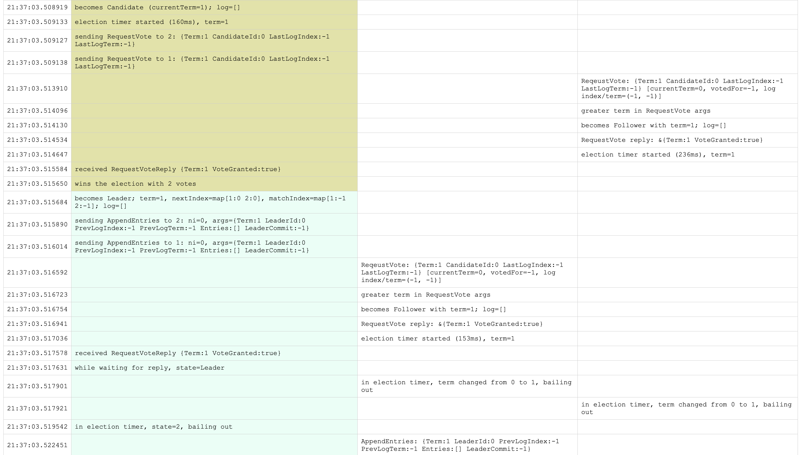
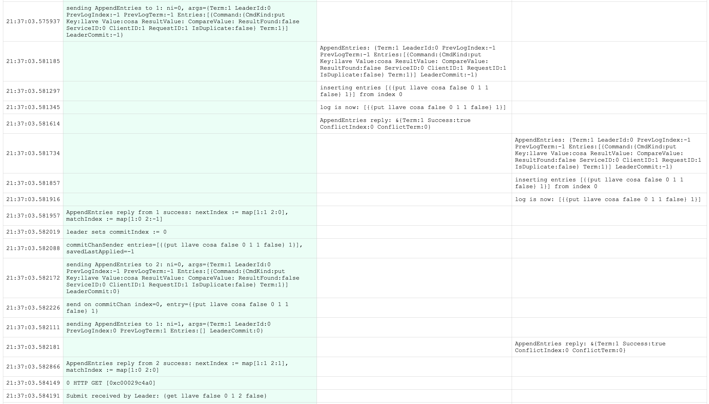

# Raft Consensus Algorithm Implementation

A complete implementation of the Raft distributed consensus algorithm in Go, built for educational purposes (mostly for myself) 
and 
practical 
understanding of how distributed consensus works in real systems.

## Overview

Raft is a consensus algorithm designed to be more understandable than Paxos while providing the same consistency guarantees. This implementation demonstrates how to build a replicated state machine that can tolerate server crashes and network partitions while maintaining strong consistency across all nodes.

## Features

- **Leader Election**: Automatic leader election with randomized timeouts
- **Log Replication**: Commands are replicated across cluster nodes before being committed
- **Persistence**: State persists across server crashes and restarts
- **Key/Value Database**: A practical application built on top of the Raft consensus module
- **Exactly-Once Delivery**: Ensures client requests are processed exactly once
- **Strong Consistency**: Prioritizes consistency over availability (CP in CAP theorem)

## Implementation Structure

### Core Components
- **Consensus Module**: The heart of the Raft algorithm handling elections, log replication, and safety
- **Persistent Log**: Commands are stored persistently before being applied to the state machine
- **State Machine**: The actual service (e.g., key/value store) that processes committed commands

### Server States
- **Follower**: Default state, responds to RPCs from candidates and leaders
- **Candidate**: Attempts to become leader during election periods  
- **Leader**: Handles client requests and replicates log entries to followers

### Core RPCs
- **RequestVote**: Used during leader election to gather votes
- **AppendEntries**: Used for log replication and leader heartbeats

## Getting Started

### Prerequisites

- Go 1.16 or higher
- Understanding of the Raft paper (recommended reading)

### Installation

```bash
git clone github.com/srivastavcodes/raft-consensus-algo-impl
cd raft-consensus-algo-impl
go build ./...
```

### Running the Implementation

The implementation uses Go's `net/rpc` for inter-server communication. Each part can be tested independently using the provided test suite.

### Example Test Run



*Demonstration of the core functionality of **Raft's** leader election*



*storing and retrieving data in a 3-node Raft cluster*

### Key/Value Database Example

The implementation includes a complete key/value database built on Raft:

- **PUT key value**: Store a key-value pair
- **APPEND value on key**: Append value to a pre-existing key - create if not exist.
- **GET key**: Retrieve a value for a key
- **CAS key old_value new_value**: Compare-and-swap operation

Clients connect to any server in the cluster, and the system automatically handles routing to the leader.

## Testing

The implementation includes comprehensive tests for each component:

```bash
# Run tests on each component at once
go test           # Test the entire system

# Test specific components
go test raft/     # Core Raft algorithm tests
```
## References

- [Raft Paper](https://raft.github.io/raft.pdf) - "In Search of an Understandable Consensus Algorithm" by Diego Ongaro and John 
  Ousterhout.
- [Raft Website](https://raft.github.io/) - Interactive visualizations and additional resources.
- [The Green Place](https://eli.thegreenplace.net/) - Comprehensive guide to building the Raft algorithm.
- [Diego Ongaro's PhD Dissertation](https://github.com/ongardie/dissertation) - Comprehensive treatment of Raft.

## License

This project is licensed under the MIT License - see the [LICENSE](LICENSE) file for details.
